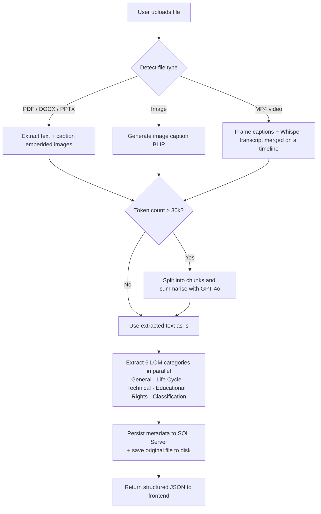

# Automatic Metadata Extraction from Educational Materials using AI

An application that automatically generates **IEEE LOM (Learning Object Metadata)** for
educational resources - PDFs, Word documents, PowerPoint presentations, images and videos -
by combining large language models, image captioning and speech-to-text transcription.

The user uploads a learning resource; the system extracts its textual, visual and audio
content, and an AI pipeline produces structured metadata organised according to the
**IEEE 1484.12.1 Learning Object Metadata** standard. The results are stored in a database,
can be browsed and organised into folders, and can be edited by the user.

## Authors

| Student | Index |
|---|---|
| Nebojša Vuga | R2 23/2024 |
| Bogdan Janošević | R2 43/2024 |

## Table of Contents

- [Features](#features)
- [Extracted Metadata (IEEE LOM)](#extracted-metadata-ieee-lom)
- [Architecture](#architecture)
- [Processing Pipeline](#processing-pipeline)
- [Technology Stack](#technology-stack)
- [Prerequisites](#prerequisites)
- [Setup and Running](#setup-and-running)
  - [Backend](#1-backend-flask-api)
  - [Frontend](#2-frontend-angular)
- [REST API](#rest-api)
- [Data Model](#data-model)
- [Project Structure](#project-structure)
- [Limitations and Notes](#limitations-and-notes)

## Features

- **Multi-format ingestion** — extracts content from PDF (`.pdf`), Word (`.docx`),
  PowerPoint (`.pptx`), images (`.jpg`, `.jpeg`, `.png`) and video (`.mp4`).
- **Multi-modal understanding** — text is read directly, embedded images are described with an
  image-captioning model, and video is processed both visually (periodic frame captions) and
  aurally (speech transcription), then merged into a single timeline.
- **IEEE LOM metadata generation** — produces metadata across six LOM categories (General,
  Life Cycle, Technical, Educational, Rights, Classification).
- **Long-document handling** — documents exceeding the token limit are automatically split and
  summarised before metadata extraction.
- **Parallel extraction** — the six metadata categories are generated concurrently to reduce
  processing time.
- **Persistence and organisation** — extracted metadata and the original file are stored; files
  can be grouped into a hierarchy of folders.
- **Review and edit** — a web UI lets the user upload files, browse previously processed files,
  preview the original document, and edit the generated metadata.

## Extracted Metadata (IEEE LOM)

The generated metadata follows the IEEE Learning Object Metadata categories:

| Category | Extracted fields |
|---|---|
| **General** | title, language, description, keywords, structure, coverage, aggregation level |
| **Life Cycle** | version, status, contribute |
| **Technical** | format, size, location, requirements, installation remarks, duration (audio/video) |
| **Educational** | interactivity type & level, learning resource type, semantic density, intended end-user role, context, typical age range, difficulty, typical learning time, description |
| **Rights** | cost, copyright/restrictions, description |
| **Classification** | purpose, taxon path, description, keywords |

> A **Relation** category is defined in the data model but is not currently populated by the
> extraction pipeline.

## Architecture

```
┌──────────────────┐        HTTP/JSON        ┌───────────────────────────┐
│  Angular 18 SPA  │  ───────────────────▶   │      Flask REST API       │
│  (Material UI)   │  ◀───────────────────   │        (main.py)          │
└──────────────────┘                         └────────────┬──────────────┘
                                                          │
                     ┌────────────────────────────────────┼───────────────────────────────┐
                     │                                    │                                │
             ┌───────▼────────┐                  ┌────────▼─────────┐            ┌─────────▼─────────┐
             │ Text/media      │                  │  AI extraction   │            │  SQL Server        │
             │ extraction      │                  │  (OpenAI GPT-4o) │            │  (metadata +       │
             │ • PyMuPDF/PyPDF2│                  │  per LOM category│            │   file records)    │
             │ • python-docx   │                  └──────────────────┘            └────────────────────┘
             │ • python-pptx   │                                                  Original files stored
             │ • BLIP captions │                                                  on disk (metadata_files/)
             │ • Whisper (ASR) │
             └─────────────────┘
```

## Processing Pipeline



1. **Upload** — the frontend posts the file to the API, optionally targeting a folder.
2. **Content extraction** — depending on the file type, text is read and embedded images are
   captioned (BLIP); videos are transcribed (Whisper) and sampled for frame captions.
3. **Summarisation (if needed)** — if the extracted text exceeds ~30,000 tokens, it is split
   into ~2,000-word segments and summarised before further processing.
4. **Metadata extraction** — each of the six LOM categories is generated concurrently, one field
   at a time, using tailored GPT-4o prompts.
5. **Persistence** — the original file is written to `metadata_files/` and its metadata is
   inserted into the database.
6. **Response** — the structured metadata is returned to the UI as JSON.

## Technology Stack

| Layer | Technology |
|---|---|
| Frontend | Angular 18, Angular Material |
| Backend | Python, Flask, Flask-CORS |
| Language model | OpenAI GPT-4o (Chat Completions API) |
| Image captioning | BLIP (`Salesforce/blip-image-captioning-base`, via `transformers`) |
| Speech-to-text | OpenAI Whisper (`base` model) |
| Text/media extraction | PyMuPDF, PyPDF2, python-docx, python-pptx, MoviePy, Pillow |
| Tokenisation | tiktoken |
| Database | Microsoft SQL Server (accessed via `pyodbc`) |
| File storage | Local filesystem (path recorded in the database) |

## Prerequisites

- **Python 3.10+**
- **Node.js** and **Angular CLI 18** (for the frontend)
- **Microsoft SQL Server** (e.g. SQL Server Express) and the **ODBC Driver 17 for SQL Server**
- **FFmpeg** available on the system `PATH` (required by MoviePy and Whisper for audio/video)
- An **OpenAI API key** with access to `gpt-4o`

## Setup and Running

### 1. Backend (Flask API)

From the `backend/server` directory:

```bash
# Create and activate a virtual environment
py -m venv venv
venv\Scripts\activate            # Windows
# source venv/bin/activate        # macOS / Linux

# Install dependencies (from the repository root's requirements.txt)
pip install -r ../../requirements.txt
```

**Configure the OpenAI API key** (the backend reads it from the `OPENAI_API_KEY` environment
variable):

```bash
setx OPENAI_API_KEY "your-api-key"     # Windows (new shells)
# export OPENAI_API_KEY="your-api-key"  # macOS / Linux
```

**Configure the database** in `backend/server/db_config.json`:

```json
{
    "server": "YOUR-SERVER\\SQLEXPRESS",
    "database": "MetadataExtraction",
    "driver": "{ODBC Driver 17 for SQL Server}"
}
```

**Create the database schema.** The table-creation script lives in
`backend/db_scripts/create_tables.sql`. It can be run against the database directly, or by
temporarily enabling the helper calls at the bottom of `main.py`:

```python
# create_tables('../db_scripts/create_tables.sql', 'db_config.json')
# insert_user('db_config.json')
```

**Run the server:**

```bash
py main.py
```

The API starts on `http://localhost:5000/`.

### 2. Frontend (Angular)

From the `frontend` directory:

```bash
npm install
ng serve
```

The application is served on `http://localhost:4200/`. The API base URL is configured in
`frontend/src/environment/environment.ts` (`apiHost`, default `http://localhost:5000/`).

## REST API

| Method | Endpoint | Description |
|---|---|---|
| `POST` | `/?folderId={id}` | Upload a file (multipart `file`); extracts and stores metadata, returns it as JSON |
| `GET` | `/` | List all processed files |
| `GET` | `/{file_id}` | Get the metadata of a file |
| `PUT` | `/{file_id}` | Update the metadata of a file |
| `DELETE` | `/{file_id}` | Delete a file and its metadata |
| `GET` | `/file/{file_id}` | Download the original file (base64-encoded, with MIME type) |
| `GET` | `/folders` | List all folders |
| `POST` | `/folders` | Create a folder (`name`, optional `parent_folder_id`) |
| `DELETE` | `/folders/{folder_id}` | Delete a folder |

## Data Model

The relational schema (see `Database_model.jpg` and `backend/db_scripts/create_tables.sql`)
consists of four tables:

- **Users** — application users.
- **MetadataFolders** — self-referencing folder hierarchy (`parent_folder_id`).
- **UploadedFile** — one row per processed file (name, size, on-disk path, owning user and folder).
- **Metadata** — one row per file holding all IEEE LOM fields, linked to `UploadedFile`.

Original files are stored on disk (in `metadata_files/`) and referenced by path from the
`UploadedFile` table.

## Project Structure

```
metadata-extraction/
├── README.md
├── requirements.txt              # Python dependencies
├── Database_model.jpg            # ER diagram of the database
├── backend/
│   ├── flow.md                   # High-level description of the processing flow
│   ├── db_scripts/
│   │   └── create_tables.sql     # Database schema
│   └── server/
│       ├── main.py               # Flask app and REST endpoints
│       ├── model.py              # TextAnalyzer: orchestrates the extraction pipeline
│       ├── metadata.py           # IEEE LOM metadata data classes
│       ├── text_extractors.py    # PDF/DOCX/PPTX/image/video content extraction
│       ├── general_data_extraction.py        # General category prompts
│       ├── life_cycle_data_extraction.py      # Life Cycle category prompts
│       ├── technical_data_extraction.py       # Technical category (+ file size/format/duration)
│       ├── educational_data_extraction.py     # Educational category prompts
│       ├── rights_data_extraction.py          # Rights category prompts
│       ├── classification_data_extraction.py  # Classification category prompts
│       ├── sql_service.py        # Database access (pyodbc)
│       └── db_config.json        # Database connection settings
└── frontend/                     # Angular 18 single-page application
    └── src/app/
        ├── features/             # home, files, metadata views
        ├── services/             # API and notification services
        └── model/                # TypeScript metadata/file models
```

## Limitations and Notes

- The **`OPENAI_API_KEY`** environment variable must be set; metadata extraction calls the
  OpenAI GPT-4o API and will fail without it.
- Metadata fields are requested individually with short pauses between calls to stay within API
  rate limits, so processing a single large document can take several minutes.
- Video and audio processing depend on **FFmpeg** and download the Whisper and BLIP models on
  first run.
- The **Relation** LOM category is present in the data model but not yet produced by the
  pipeline.
- Authentication is not enforced by the API; a single seed user is created by the helper script.
